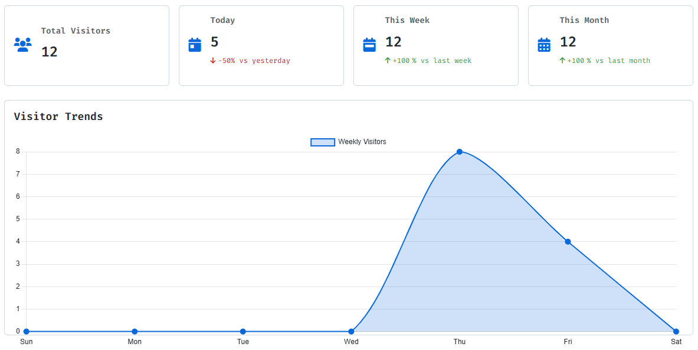

# Free Visitor Counter (API, Dashboard)
> 🇰🇷 [한국어 README 보기](README.md)

A lightweight, **free** visitor counter for websites with a beautiful dashboard and API.

<picture>
  <source srcset="static/img/dashboard-dark.png" media="(prefers-color-scheme: dark)">
  <source srcset="static/img/dashboard.png" media="(prefers-color-scheme: light)">
  
</picture>

<p align="center"><i>🖥️ Live dashboard preview – supports dark/light theme automatically</i></p>

## 📋 Table of Contents

- [Features](#-features)
- [Quick Start](#-quick-start)
- [NPM Package](#-npm-package)
- [API Documentation](#-api-documentation)
- [Dashboard](#-dashboard)
- [Contributing](#-contributing)
- [License](#-license)

## ✨ Features

- **100% Free**: No hidden costs or premium features
- **Real-time Tracking**: Track visitors in real-time with accurate counting and duplicate prevention
- **Responsive Dashboard**: View your visitor statistics on any device with our responsive dashboard
- **Easy Integration**: Simple API makes it easy to integrate with any website or application
- **Multiple Websites**: Track visitors across multiple domains with a single account
- **Dark/Light Theme**: Switch between dark and light themes for comfortable viewing
- **Duplicate Prevention**: Uses Redis with a 20-minute TTL to avoid counting the same visitor multiple times
- **Timezone Support**: Calculates "today" based on the visitor's timezone
- **NPM Package**: Official NPM package for easy integration with JavaScript frameworks
- **Page Analytics**: Track popular pages, referrers, and search queries

## 🚀 Quick Start

### 1. Add this script to your website

```html
<script>
(function() {
  const domain = encodeURIComponent(window.location.hostname);
  const timezone = encodeURIComponent(Intl.DateTimeFormat().resolvedOptions().timeZone);
  const page_path = window.location.pathname;
  const page_title = document.title;
  const referrer = document.referrer;
  
  // Extract search query if coming from a search engine
  let search_query = '';
  if (referrer) {
    try {
      const url = new URL(referrer);
      if (url.hostname.includes('google.com')) {
        search_query = url.searchParams.get('q') || '';
      } else if (url.hostname.includes('bing.com')) {
        search_query = url.searchParams.get('q') || '';
      } else if (url.hostname.includes('yahoo.com')) {
        search_query = url.searchParams.get('p') || '';
      } else if (url.hostname.includes('duckduckgo.com')) {
        search_query = url.searchParams.get('q') || '';
      }
    } catch (e) {
      // Invalid URL, ignore
    }
  }

  fetch('https://visitor.6developer.com/visit', {
    method: 'POST',
    headers: { 'Content-Type': 'application/json' },
    body: JSON.stringify({ 
      domain, 
      timezone,
      page_path,
      page_title,
      referrer,
      search_query
    })
  })
  .then(response => response.json())
  .then(data => {
    console.log('Visitor count:', data);
    // You can display the count on your page
    if (document.getElementById('visitor-count')) {
      document.getElementById('visitor-count').textContent = data.totalCount;
    }
  })
  .catch(error => console.error('Error:', error));
})();
</script>
```

### 2. View your dashboard

Go to `https://visitor.6developer.com/login` and enter your domain to see your visitor statistics.

## 📦 NPM Package

Use our official NPM package for easy integration with JavaScript frameworks:

```bash
npm install @rundevelrun/free-visitor-counter
# or
yarn add @rundevelrun/free-visitor-counter
```

### Using with React

```jsx
import { VisitorCounter } from '@rundevelrun/free-visitor-counter';

function App() {
  return (
    <div>
      <h1>My Website</h1>
      <VisitorCounter />
    </div>
  );
}
```

### Using with JavaScript

```javascript
import { trackVisit, displayCounter } from '@rundevelrun/free-visitor-counter';

// Track visit
trackVisit().then(data => {
  console.log('Visitor count:', data);
});

// Display counter in element with id "visitor-counter"
displayCounter('visitor-counter');
```

For more information, visit the [NPM package repository](https://github.com/rundevelrun/free-visitor-counter).

## 📊 API Documentation

### Base URL

```
https://visitor.6developer.com
```

### Record a Visit

```
POST /visit
```

**Request Body:**

```json
{
  "domain": "example.com",
  "timezone": "America/New_York", // Optional, defaults to UTC
  "page_path": "/blog/my-article", // Optional, the path of the current page
  "page_title": "My Article Title", // Optional, the title of the current page
  "referrer": "https://google.com", // Optional, the referrer URL
  "search_query": "my search query" // Optional, the search query if coming from a search engine
}
```

**Response:**

```json
{
  "dashboardUrl": "https://visitor.6developer.com/dashboard?domain=example.com",
  "totalCount": 42,
  "todayCount": 5
}
```

### Get Visit Statistics

```
GET /visit?domain=example.com
```

**Response:**

```json
{
  "dashboardUrl": "https://visitor.6developer.com/dashboard?domain=example.com",
  "totalCount": 42,
  "todayCount": 5
}
```

For more details, see the [API Documentation](https://visitor.6developer.com/api-docs).

## 📈 Dashboard

Access your visitor statistics dashboard at [https://visitor.6developer.com/login](https://visitor.6developer.com/login).

The dashboard provides:
- Total visitor count
- Today's visitors
- Weekly and monthly trends
- Graphical representation of visitor data
- Popular pages analysis
- Referrer analysis
- Search query analysis

## 🤝 Contributing

Contributions are welcome! Please submit a Pull Request.

## 📄 License

This project is licensed under the MIT License - see the LICENSE file for details.
