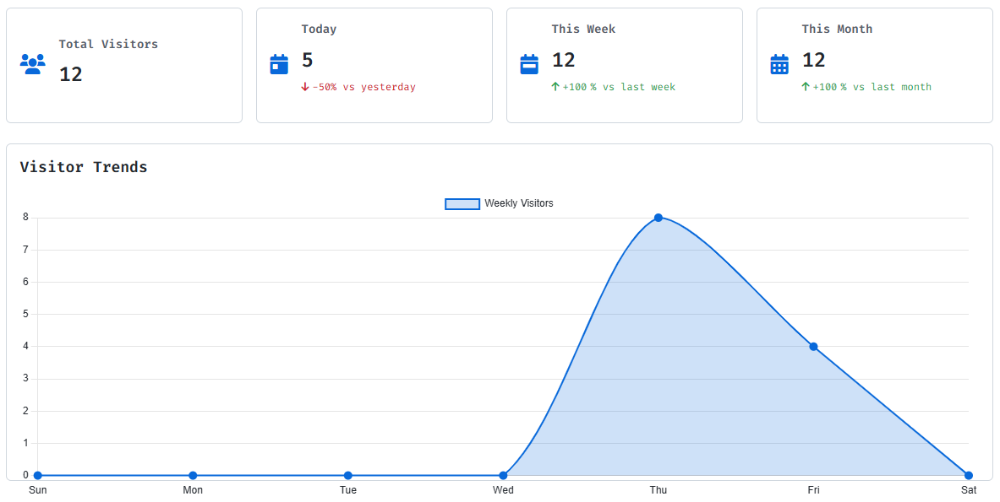

# 무료 방문자 카운터 (API, 대시보드)
> 🇺🇸 [View README in English](README.en.md)

대시보드와 API가 있는 웹사이트용 경량 **무료** 방문자 카운터입니다.

<picture> 
  <source srcset="static/img/dashboard-dark.png" media="(prefers-color-scheme: dark)">
  <source srcset="static/img/dashboard.png" media="(prefers-color-scheme: light)">
  
</picture>

<p align="center"><i>🖥️ 라이브 대시보드 미리보기 – 자동으로 다크/라이트 테마 지원</i></p>

## 📋 목차

- [기능](#-기능)
- [빠른 시작](#-빠른-시작)
- [NPM 패키지](#-npm-패키지)
- [API 문서](#-api-문서)
- [대시보드](#-대시보드)
- [기여하기](#-기여하기)
- [라이선스](#-라이선스)

## ✨ 기능

- **완전 무료**: 숨겨진 비용이나 프리미엄 기능이 없습니다
- **실시간 추적**: 정확한 카운팅과 중복 방지 기능으로 실시간으로 방문자를 추적합니다
- **반응형 대시보드**: 반응형 대시보드로 모든 기기에서 방문자 통계를 확인할 수 있습니다
- **쉬운 통합**: 간단한 API로 모든 웹사이트나 애플리케이션에 쉽게 통합할 수 있습니다
- **다중 웹사이트**: 단일 계정으로 여러 도메인의 방문자를 추적합니다
- **다크/라이트 테마**: 편안한 보기를 위해 다크 및 라이트 테마 간 전환이 가능합니다
- **중복 방지**: 20분 TTL이 있는 Redis를 사용하여 동일한 방문자를 여러 번 카운트하지 않습니다
- **시간대 지원**: 방문자의 시간대를 기준으로 "오늘"을 계산합니다
- **NPM 패키지**: JavaScript 프레임워크와 쉽게 통합할 수 있는 공식 NPM 패키지

## 🚀 빠른 시작

### 1. 웹사이트에 이 스크립트 추가하기

```html
<script>
(function() {
  const domain = encodeURIComponent(window.location.hostname);
  const timezone = encodeURIComponent(Intl.DateTimeFormat().resolvedOptions().timeZone);
  
  fetch('https://visitor.6developer.com/visit', {
    method: 'POST',
    headers: { 'Content-Type': 'application/json' },
    body: JSON.stringify({ domain, timezone })
  })
  .then(response => response.json())
  .then(data => {
    console.log('방문자 수:', data);
    // 페이지에 카운트를 표시할 수 있습니다
    if (document.getElementById('visitor-count')) {
      document.getElementById('visitor-count').textContent = data.totalCount;
    }
  })
  .catch(error => console.error('오류:', error));
})();
</script>
```

### 2. 대시보드 보기

`https://visitor.6developer.com/login`으로 이동하여 도메인을 입력하면 방문자 통계를 볼 수 있습니다.

## 📦 NPM 패키지

공식 NPM 패키지를 사용하여 JavaScript 프레임워크와 쉽게 통합할 수 있습니다:

```bash
npm install @rundevelrun/free-visitor-counter
```

### React에서 사용하기

```jsx
import { VisitorCounter } from '@rundevelrun/free-visitor-counter';

function App() {
  return (
    <div>
      <h1>내 웹사이트</h1>
      <VisitorCounter />
    </div>
  );
}
```

### JavaScript에서 사용하기

```javascript
import { trackVisit, displayCounter } from '@rundevelrun/free-visitor-counter';

// 방문 기록
trackVisit().then(data => {
  console.log('방문자 수:', data);
});

// "visitor-counter" ID를 가진 요소에 카운터 표시
displayCounter('visitor-counter');
```

자세한 내용은 [NPM 패키지 저장소](https://github.com/rundevelrun/free-visitor-counter)를 참조하세요.

## 📊 API 문서

### 기본 URL

```
https://visitor.6developer.com
```

### 방문 기록하기

```
POST /visit
```

**요청 본문:**

```json
{
  "domain": "example.com",
  "timezone": "Asia/Seoul" // 선택 사항, 기본값은 UTC
}
```

**응답:**

```json
{
  "dashboardUrl": "https://visitor.6developer.com/dashboard?domain=example.com",
  "totalCount": 42,
  "todayCount": 5
}
```

### 방문 통계 가져오기

```
GET /visit?domain=example.com
```

**응답:**

```json
{
  "dashboardUrl": "https://visitor.6developer.com/dashboard?domain=example",
  "totalCount": 42,
  "todayCount": 5
}
```

자세한 내용은 [API 문서](https://visitor.6developer.com/api-docs)를 참조하세요.

## 📈 대시보드

[https://visitor.6developer.com/login](https://visitor.6developer.com/login)에서 방문자 통계 대시보드에 접속할 수 있습니다.

대시보드는 다음을 제공합니다:
- 총 방문자 수
- 오늘의 방문자
- 주간 및 월간 추세
- 방문자 데이터의 그래픽 표현

## 🤝 기여하기

기여는 환영합니다! Pull Request를 제출해 주세요.

## 📄 라이선스

이 프로젝트는 MIT 라이선스에 따라 라이선스가 부여됩니다 - 자세한 내용은 LICENSE 파일을 참조하세요.
